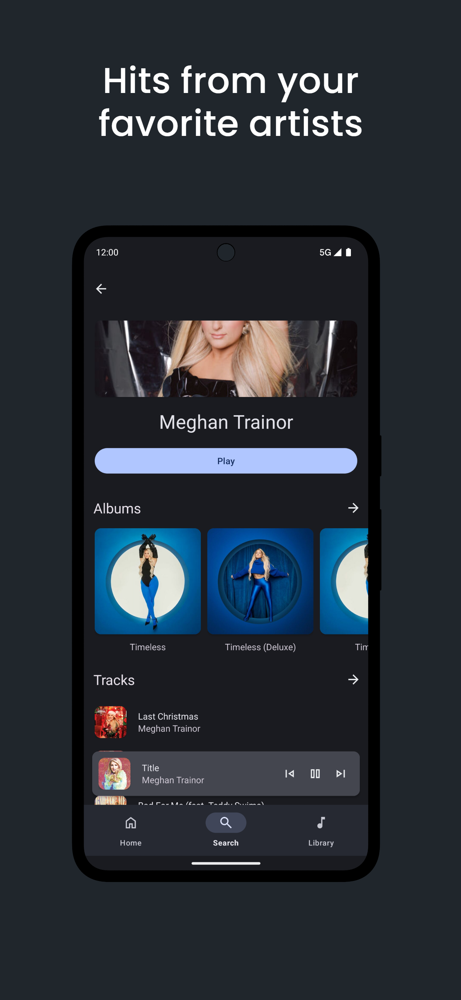

    
    <h3>Beat</h3>
    
play literally any song in the world

## get started
beat costs $7, which is a one-time payment that gives you access and lifetime updates, with no monthly subscriptions or additional fees. sponsor the github to unlock access to the [beatcorp/releases](https://github.com/beatcorp/releases) repository, where you’ll find the apk.

currently, it's only available on android, but we plan to release it on more devices and extend your one-time license to them. our web/desktop version is 50% done.

## screenshots

    
    
    
    
    

## features

### 🚀 native android experience

- **fast & familiar**  
  beat is built entirely using the android api, ensuring a fast, reliable, and native experience.

- **media3 exoplayer**  
  featuring special integration with the latest android versions for enhanced media control via the system media center.

### 🎨 stunning material you design

- **material design**  
  experience the latest in material design 3, offering a fresh, customizable look.

- **edge-to-edge design**  
  sleek and modern, taking full advantage of screen space.

- **material you**  
  adapts to your device's wallpaper, personalizing colors and accents across the app.

### 🌍 decentralized

- **add external sources**  
  stream media directly from external sources with just a url

- **cloud-synced playlists**  
  all your data is stored on your chosen main server, keeping it synced across any device within your account

- **community-managed servers**  
  we're working towards decentralized, community-managed central servers in the near future

- **server docs**  
  full server documentation will be available soon in our docs

### 🛡️ tor-proxied privacy

- **anonymous streaming**  
  beat uses the tor network to protect both ends, offering complete anonymity

- **onion domain support**  
  access decentralized onion domains without compromising privacy

### 📡 torrent-enabled streaming

- **bittorrent & webtorrent support**  
  stream torrents from both bittorrent and webtorrent networks

- **progressive buffering**  
  enjoy quick play with progressive buffering for uninterrupted streaming